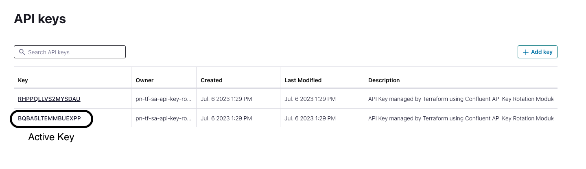
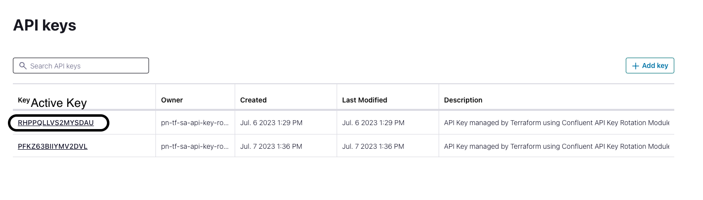

# Confluent Cloud Terraform Example
We try out the [Confluent Terraform Provider](https://docs.confluent.io/cloud/current/get-started/terraform-provider.html).
In addition, we want to try out the [api-key-rotation module](https://registry.terraform.io/modules/nerdynick/api-key-rotation/confluent/latest).

## Resources
* [Documentation](https://registry.terraform.io/modules/nerdynick/api-key-rotation/confluent/latest)
* [GitHub Repository Example](https://github.com/nerdynick/terraform-confluent-api-key-rotation)


## Run Terraform

We encrypted sensitive information (variables.tf) with [Blackbox](https://github.com/StackExchange/blackbox).
This contains the `cloud API key` and `cloud API secret`.

Due to the limitation of Terraform and Time Based rotation. You must execute th module on a regular bases that is equal to or less than the configured number of days to rotate

Checking the code, it seems that `ttl` days are converted into hours and when
applying the module it compares if we need to re-create a key based on the current time.


```terraform
terraform apply
```

## API Keys at day 0

Check active key with
```terraform
terraform output active-API-key
```



## API Keys at day 1 ( > 24 hours = 1 day ttl)

We need to execute the Terraform script again.
* The old active key is deleted
* The other key becomes the new active key
* Another key is created


